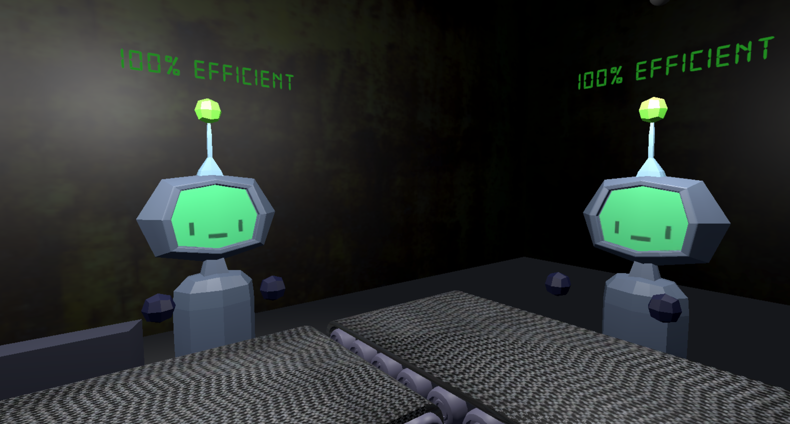

# 🧪 Labubu Factory

A chaotic game created during a game jam in 2 days using Unity.

## 🎮 About the Game

In *Labubu Factory*, your goal is simple:  
**destroy the factory from the inside and make the game crash.**

You play as a disruptive force inside a mysterious Labubu production facility, where your actions progressively break the system, leading to increasingly unstable gameplay.

The more you interact with the factory, the more the game starts to fall apart…

## 🧠 Core Idea

This project was built around a single experimental concept:

> What if the goal of the player was to intentionally break the game itself?

## 🛠️ Features

- Destructible / unstable factory environment
- System breakdown mechanics triggered by player actions
- Progressive performance degradation / chaos escalation
- Experimental gameplay loop focused on “breaking the game”

## ⚙️ Built With

- Unity
- C#

## ⏱️ Development

- Created in **2 days**
- Developed during a game jam
- Focused on rapid prototyping and experimental design

## 🎯 Role

Gameplay programming, systems design, and implementation of core interactions and breakdown mechanics.

## 🚀 Goal of the Project

This project was an exploration of:
- systemic gameplay
- emergent chaos
- breaking traditional game objectives

Instead of winning, the player’s objective is to push the game into instability.

---

